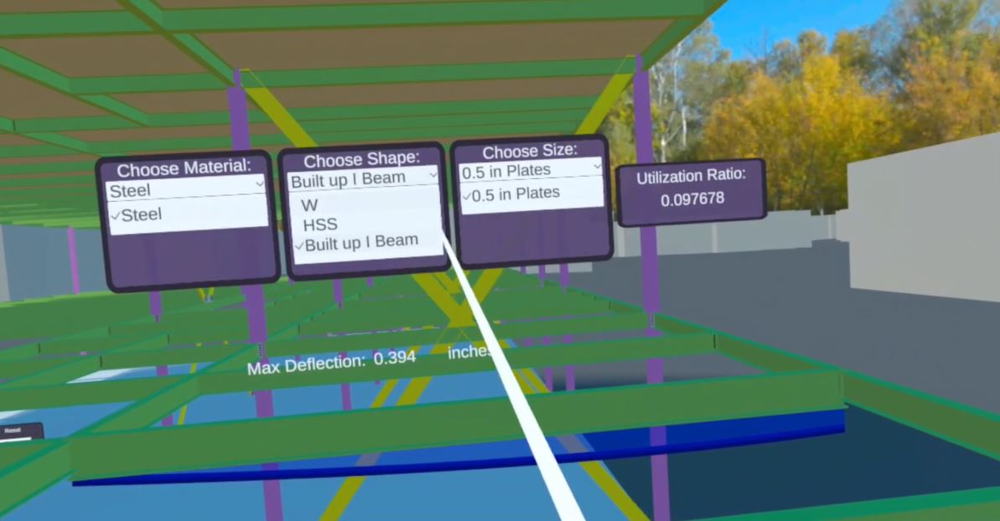
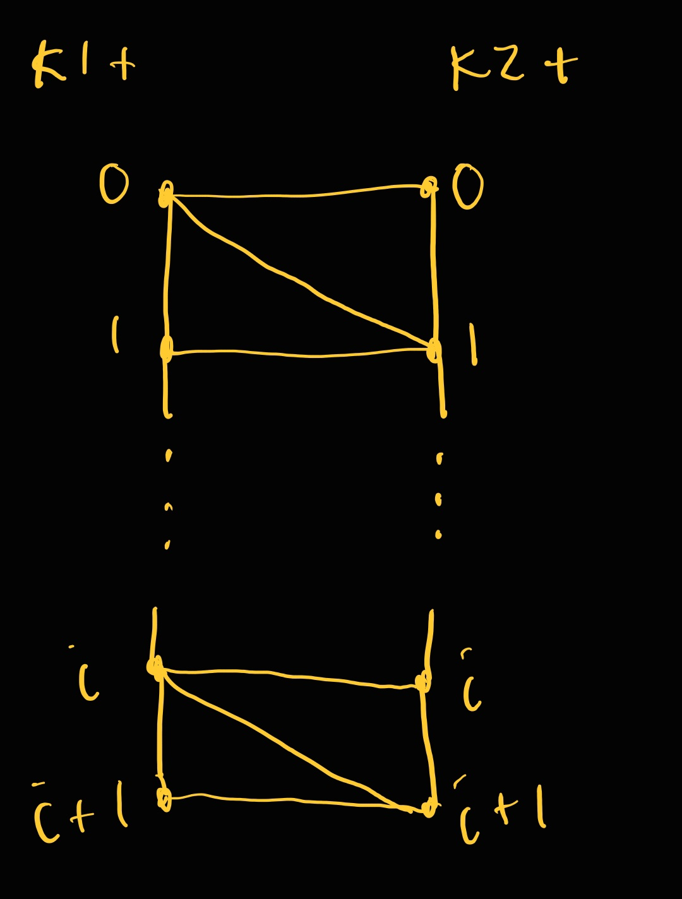
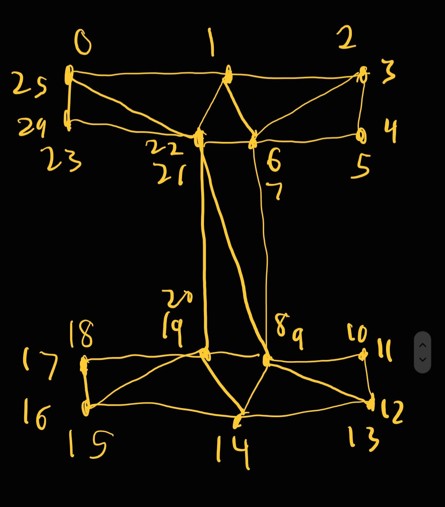
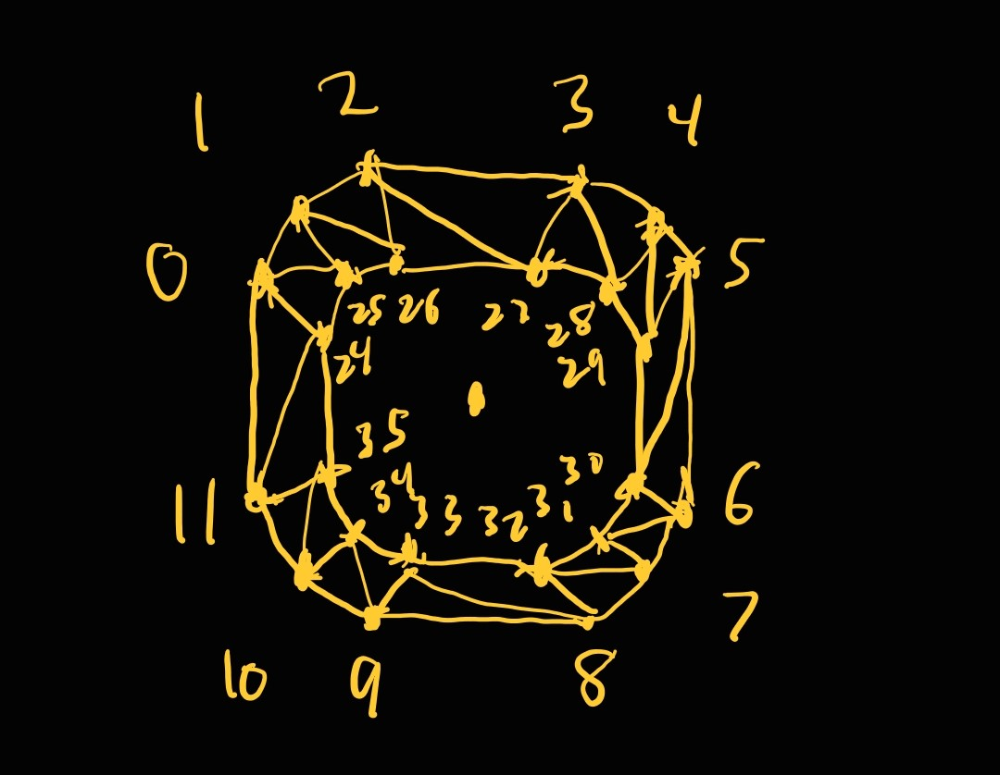

# VR Structural Beam Design Module

This GitHub repository is my code contribution for the VR Structural Beam Design Module for a project with the [SMARTI Lab](https://sychterz.cee.illinois.edu/) under Dr. Ann Sychterz. The goal of the overall project is to teach undergraduates about building system analysis and design using VR. The goal of this specific module is to teach undergraduate seniors about structural beam design in VR and to incorporate analysis results from the structural analysis program SAP2000 with VR.

The paper for this part of the project can be found here:
* [Case Study: Developing and Implementing VR Technology for Civil Engineering Education](https://peer.asee.org/case-study-developing-and-implementing-vr-technology-for-civil-engineering-education)

If you use any part of this code, ideas, or figures below, please be sure to cite these papers!!

My main contribution for this module was not only implementing the gameplay mechanics and GUI in the Unity gaming engine, but also going above and beyond to make the workflow behind the game development process more automated, scalable, and efficient. 

These features include:
* Developing an automated workflow using C# to increase the scalability and ease of adding new beam shapes and sizes from SAP2000 data to the module
* Creating and implementing algorithms using C# to procedurally generate beam meshes of three different shapes and an infinite number of sizes to reduce 3D model storage and creation effort
* Designing an algorithm using C# to calculate and draw beam deflection diagrams using end translations and rotations directly from SAP2000

Everything in the module could have been manually done with Unity to get to the same end product. However, I wanted to make the development process as easy as possible for myself, so I created this automated workflow, which was not an original vision for the research. With this workflow, adding more beam sizes is as easy as adding a line to an Excel file. No more creating additional UI, creating new meshes, or spending more effort or time to add more sizes. 

I was the sole developer of several C# scripts and their associated methodologies for procedural generation of beam meshes and UI including:
* Reading and accessing an Excel file with all of the properties and SAP2000 results for each particular beam (ElemPropManager.cs)
* A main script that procedurally generates the UI, implements the UI mechanics, calls the correct function to procedurally generate the desired beam and deflection meshes, and renders the beam and deflection meshes (ElemDesign.cs)
* A series of scripts that procedurally generate different meshes including a deflection mesh, a plate mesh, a W shape beam mesh, a HSS shape beam mesh, and a built up I beam (MeshDesigner.cs, DeflMesh.cs, PlateMesh.cs, WMesh.cs, HSSMesh.cs, and BuiltUpWMesh.cs)

Very detailed descriptions of what each script does and how they work can be found in the following sections. For references for this README, please see the code.

Note: Only the parts of the code that I solely developed are included in this GitHub. For the full project, please contact Dr. Sychterz.

## What is the VR Structural Beam Design Module?
This module is meant to teach undergraduate seniors about how to design a structural beam. The user can choose a beam material, shape, and size and see how their choices affect the max deflection, deflected shape, and utilization ratio. 
 
I designed and created the module in the Unity gaming engine with 1 material choice, 3 shape choices, and 1 size choice per shape. The available material choice is steel, while the available shape choices include W-shape, rectangular / square HSS, and a built up I beam (a W-shape with a top plate and bottom plate). The user chooses these options via 3 dropdowns that are procedurally generated. After a beam is chosen, the deflected shape of the beam is shown as calculated from SAP2000 results. Also, the max deflection and utilization ratio (both directly from SAP2000) are also shown.

The figure below shows an example of what this module looks like.

## Reading and accessing an Excel file with all of the properties and SAP2000 results for each particular beam
In the "Resources" folder in the Unity project's "Asset" folder, there must be a .csv file with all of the beam's potential beam configurations and their corresponding SAP2000 results and dimensions. The .csv file can be created from the given Excel file. 

Each line is a beam configuration that includes information about the material, the shape, the size, the translations and rotations in 3 directions for both end points, the utilization ratio, and the dimensions. The dimensions given change depending on the beam shape. For instance, a W shape beam requires a width, a height, a flange thickness, and a web thickness, while a HSS shape beam requires a width, a height, and only one thickness. The built up I beam is set to be a W shape beam with a top plate and a bottom plate. The index of the W shape beam is required as well as the thickness of the plates. The plates are assumed to be the same width as the W shape beam.

ElemPropManager.cs reads the .csv file and creates a series of nested dictionaries to store the beam properties. The first dictionary stores the available materials as keys. Then, each material value is a dictionary that stores that material's available shapes as keys. Afterwards, each shape value is a dictionary that stores that shape's available sizes as keys. Next, each size value is a float array of the properties for that size.

This way, the properties for a particular beam and arrays of different materials, shapes, and sizes can all be retrieved easily. The properties for a particular beam are then used to procedurally generate the beam mesh and deflection mesh, while the arrays of different materials, shapes, and sizes are used to procedurally generate the dropdowns to have all the different options.

The element property manager also has a second series of nested dictionaries to store the beam meshes. As a beam mesh is procedurally generated, the beam mesh is added to the dictionary. This way, the beam mesh does not need to be generated again, saving time and computational effort. Since the number of possible options for a beam is finite, the minimally added storage space is worth the savings in computational effort and time.

## Procedurally Generating the UI
ElemDesign.cs is the main driving script that connects the other scripts together. This script is the one that is attached to the Unity game object beam.

Serializable class variables include:
* A file path string to the beam's .csv file
* The position of the end joints in SAP2000 coordinates (can be directly taken from SAP2000)
* The 4 GUI panels (material, shape, size, and utilization ratio)
* Empty game objects at the end points of the beam
* The fill material for the deflection mesh
* The number of deflection points for the deflection line
* The vertical deflection scale
* The game object for the deflection text
* The beam mesh material
* The number of points for the curve of a HSS beam

At Start(), nonserializable class variables are set and a scaling factor is calculated to convert from real life coordinates to Unity coordinates. Additionally, the element property manager is created and set up, and the beam mesh rendering and deflection rendering are set up. Setting up the rendering includes creating new game objects for the meshes, adding a mesh renderer and mesh filter, and setting the material. Also, a default material, shape, and size are chosen, and the dropdown objects are retrieved from the GUI panel game objects.

When the user hits the button in the last panel before the interactive section, the dropdowns are set up. This set up is done by setting the material panel to "active", getting an array of available material choices from the element property manager, and updating the panel options. Lastly, the "changeMaterial()" function is called to set up the rest of the panels with the default material, shape, and size.

Each dropdown has an associated "change" function that is called when the user chooses a new option. This function automatically updates the other dropdowns with the newly available choices. For instance, if a user changes the shape from W shape to HSS, then the size dropdown options are updated to include only size options for HSS beams. This process is done by retrieving the array of available sizes from the element property manager and then updating the dropdown options with that array. To keep it simple, the active option becomes the first element in the array. 

The "changeSize()" function additionally renders the beam and deflection meshes and updates the utilization ratio panel. 

First, the deflection is created. This process is done in a separate function by first procedurally generating an array of deflection points, a deflection mesh, and the max deflection (more on how these values are generated in the next section). These values are procedurally generated directly from the output provided by SAP2000 in the form of end beam translations and rotations. Next, the deflection line renderer positions are updated to match the deflection points. Additionally, the deflection fill object mesh is updated to the deflection mesh. The max deflection is then returned by the function. Afterwards, the deflection is rendered, and the max deflection text is updated.

Second, the utilization panel text is updated to match the value given by the element property manager. This utilization value comes directly from SAP2000.

Third and lastly, the beam mesh is updated using a separate function. First, the current beam mesh is cleared, and the element property manager checks if the needed beam mesh already exists in its nested dictionaries. If the needed beam mesh already exists, then the new mesh is set to that mesh. If the needed beam mesh does not exist, then the new beam mesh is procedurally generated by calling upon the current shape's corresponding custom mesh class and function (more on this process in the next section). To create a new object for the shape's mesh class, the correct dimensions must be input. These dimensions can be extracted from the beam properties float array. Also, these dimensions must be scaled from real scale to unity scale by multiplying them by the real2unity scaling factor. Then, the procedurally generated mesh is set to be the new mesh. Finally, the new mesh is set to the beam's mesh filter and rendered.

## Procedurally Generating the Beam Meshes and Deflection Meshes

For each beam shape, there exists a unique mesh class that determines the positions of the vertices and the triangles needed to create that shape. For this module, I wrote a mesh class for the deflection mesh, W shape beams, HSS beams (rectangular HSS with rounded corners), plates, and built up I beams made up of one W shape beam and a top and bottom plate. All of these unique shape mesh classes are a child class to a parent "MeshDesigner" class. Additionally, all shape mesh classes are designed to only require the end point positions of the beam and the general dimensions needed for that shape (i.e. height, width, thickness, etc.). Also, all shape mesh classes were optimized to only use the minimum number of vertices required to make them.

To create a mesh, one needs a Vector3 array of the position of each vertex and an int array of the triangles. Each triangle is made of three vertices, represented as the indices of the vertex in the vertex array. The triangle array is flattened so that every 3 vertices form a triangle. For instance, the first three values of the int array describe the 3 indices in the vertex array of the vertices that make up the triangle.

Note: Due to how the triangles are calculated, the materials for the beam and deflection meshes must have the "Render Face" property set to "Both" in the Inspector.

### Parent class: MeshDesigner
This parent class takes in two end point locations of the beam and has 3 functions for creating different types of faces made of triangles. The output of these 3 functions is an int array of triangles. 

The first function creates "open loop" faces, while the second function creates "closed loop" faces. In this case, "open loop" faces are ones that do not create a loop, while "closed loop" faces do create a loop. For instance, the end faces of a cylinder would be "open loop" faces, while the surface of the rounded part of a cylinder would be a "closed loop" face since it wraps around itself and forms a loop. 

Both of these functions assume the face can be defined by two lines of vertices. The vertices in the same line must be sequential, and both lines must have the same number of vertices. This way, there will be two sets of triangles: one set where one vertex of the triangle is along line 1 and the other two vertices are along line 2, and the second set where one vertex of the triangle is along line 2 and the other two vertices are along line 1. Due to the vertices in the same line being sequential and both lines having the same number of vertices, the one lone vertex and the other two vertices have a relationship. Say the one lone vertex is vertex k1 + i, then the other two vertices will be k2 + i and k2 + i + 1, where k1 is the starting index of the first array and k2 is the starting index of the second array. 

The figure below shows an example of this set up. 

Knowing this relationship, we can create a for loop that for each iteration, adds two triangles: one for line 1 and one for line 2. The number of iterations is the length of the vertex arrays minus 1 for the "open loop" face and the length of the vertex arrays exactly for the "closed loop" face. The extra iteration for the "closed loop" face allows the face loop to be closed by adding two extra triangles.

For both functions, the starting indices of vertex array 1 and vertex array 2 based on the master vertex array for the mesh and the length of both vertex arrays must be given. Setting up the inputs this way increases flexibility for where the arrays start and saves both computational effort and storage space by not having to create separate vertex arrays to feed into the algorithm.

The third function, CreateWOuterTri(), creates triangles for an outer shell (ie faces that connect two end faces) that has sharp edges (ie the faces on the length of a W shape beam). The sharp edges are created by duplicating each vertex on an edge and then using one vertex for the triangles on one side of the edge and the other vertex for the triangles on the other side of the edge. The duplicated vertices prevent the normals along the edge from being smoothed out since normals are interpolated across faces.

The third function assumes that the vertices (including the duplicated vertices) are numbered in a clockwise fashion around the end face. Additionally, the numbering for the vertices for the second end face must come after the vertices for the first end face. For example, if each end face has 10 vertices, then it is assumed that the starting index for the first end face is 0, while the starting index for the second end face is 10. 

The main idea for the third function is go around the end face and connect each edge of the end face with the corresponding edge on the other end face. This connection is constructed by creating an open loop face with the two edges. Think of each edge being represented by an array of vertices and then we want to draw an open loop face to connect those two edges. For simplicity, it is assumed that most edges on the end face are made up of the same number of vertices (usually two for a low poly mesh). However, an edge may have an outlier number of vertices.

These conditions are why the function requires an int array of size n of indices where the number of vertices on the edge are not typical, an int array of size n+1 where the number of vertices on the outlier edges as well as a typical edge are given, and an int that represents the number of vertices on an end face. The reason the second int array is size n+1 is because there must be one number of vertices for each outlier in addition to a number that represents a typical edge.

### Deflection Mesh
The deflection mesh class is probably the most complex since it involves not only creating the deflection mesh, but also providing points for the deflection line, retrieving the max deflection, and converting the direct SAP2000 output to actual deflections along the beam. 

The inputs for this class include:
* The positions of the end points of the beam in Unity coordinates
* The translation and rotation values for joint i and joint j of the beam in SAP2000 coordinates
* The positions of joint i and joint j of the beam in SAP2000 coordinates
* The desired vertical deflection scale (since the real life deflections tend to be extremely small and might not otherwise show up)
* The number of points desired to define the deflection line
* The scaling factor to go from SAP2000 coordinates to Unity coordinates

First, the translations and rotations for each end point are extracted and separated into 4 Vector3 objects (2 per end point). 

Next, the deflections along the beam are calculated from the end translations and rotations. The SAP2000 deflection outputs only include the end beam translations and rotations, so these must be converted to deflection values along the beam. According to the CSI Knowledge base, the displacements along a beam are calculated in SAP2000 using cubic interpolation, where the cubic coefficients are calculated from the translations and rotations of the end beam points. This process is generally simulated in my script using the end point x locations adjusted by the x translations and the slopes at the end points. The slopes at the end points are calculated from the rotations. From these values, the cubic coefficients are calculated using linear algebra. Then, cubic interpolation is done to retrieve the y deflection of the points along the beam. Afterwards, the max deflection is extracted. Keep in mind, this part is all done in SAP2000 coordinates.

Then, the y deflections need to be converted from SAP2000 coordinates to Unity coordinates and multiplied by the chosen vertical scaling factor. In Unity for this particular beam, the axis along the beam is actually the z axis. Therefore, the deflection points will be an array of Vector3, where the x value constantly stays as the end point 1 x value, the y value matches the y deflection value, and the z value changes as you move along the beam. 
The z values are saved in an array to be used later. 

Now that the deflection points are retrieved, the deflection mesh is built. The mesh vertices consist of the deflection points array and the z values array being concatenated together. The triangles array is calculated by creating an "open loop" face using the deflection points array as vertex line 1 and the z values array as vertex line 2.

Finally, the deflection points array, the newly created mesh, and the max deflection value are returned.

### W shape Beam
A W shape beam requires a beam / flange width, a beam height / depth, a flange thickness, and a web thickness.

The vertices for the W shape beam are determined as follows. Imagine a grid with four horizontal lines: each corresponding with a top or bottom line of a flange. Add four vertical lines: the outer 2 lines define the width of the w beam. The inner 2 lines define the web of the beam. The two inner horizontal lines have 4 vertices each at the intersections between the vertical lines and the horizontal line. The two outer horizontal lines have 3 vertices each: two on the outside and one at the centerline. This gives a total of 4 * 2 + 3 * 2 unique vertices = 14 unique vertices. All outside edges will have two vertices to make the normals sharp.

The figure below shows an example of the vertex numbering as well as the triangles for an end face. Reminder that all outside edges will have two vertices to make the normals sharp.

The end face triangles and the vertex numbering are hard coded in the script. However, the positions of the vertices are dependent on the given dimensions of the beam to allow procedural generation of any W shape beam size.

The end faces are then connected with triangles using the third function in the MeshDesigner.cs script.

### HSS Beam (rectangular with rounded corners)
This script creates rectangular (which includes square) HSS beams with rounded corners. The required dimensions include the width w, height h, and thickness t of the HSS beam. Additionally, number of points, num_pts_curve, along a rounded corner can be changed to produce a smoother corner. 

HSS face ends consist of one outside edge loop and one inside edge loop. The corners are rounded to have a radius of 2t.

Each edge loop consists of 8 + 4 * num_pts_curve vertices. This number is calculated by for each corner, there is a vertex at the beginning of the curve, a vertex at the end of the curve, and then the vertices that make up the curve. The positions of these vertices are calculated by assuming that the center of the edge loop is at point x = 0 and y = 0. The vertices on the curve are calculated using the equation of a circle. There are then 4 corners. Afterwards, the position of the end point of the beam is added to the positions of the vertices.

To determine the vertices of the HSS beam, the outside and inside edge loop are calculated for one end face and then this is repeated for the other end face. These vertex lists are then concatenated together. The figure below shows an example of the vertices and triangles for the end face of an HSS beam, where num_pts_curve = 1.

For the triangles, closed loop faces are created to connect the outside edge loops together. Next, closed loop faces are created to connect the inside edge loops together. Then, closed loop faces are created for both end faces.

### Plate
The plate mesh is created with 8 unique vertices, one for each corner. The positions of the vertices are determined from the given width and height of the plate as well as the given end points. The end face triangles are hard coded since the number of vertices is very low; however, the vertex positions change depending on the plate size, allowing for procedural generation of any plate size. The outer shell of triangles connecting the two end faces are calculated using the third function in the MeshDesigner class. 

### Built up I Beam (made up of one W shape beam and a top and bottom plate)
The built up I beam mesh is generated by creating a W beam and two plates. One plate is positioned above the W beam, and another plate is positioned below the W beam. These plates are moved by adjusting the end points of the beam to either add or subtract half the height of the W beam + half the height of the plate. Half of the height of the beam and plate are used since the assumption is that the middle of the W beam is at point (0, 0, 0) + the position of the end point of the beam. 

The vertex lists for the W beam and the two plates are then concatenated together. Before the triangle lists can also be concatenated together, the plate triangle lists must be adjusted by adding the length of the lists that come before it. For instance, if the order of the lists is as follows: W beam, top plate, bottom plate, then the length of the W beam vertex list needs to be added to the triangle vertices for the top plate. The bottom plate triangle vertices then need to have the length of the W beam vertex list and the length of the top plate vertex list added. These additions ensure that the triangles render correctly.

